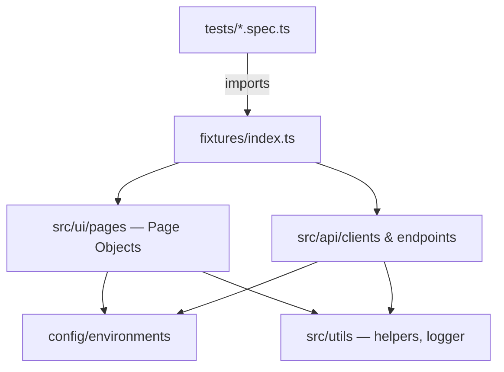

<div align="center">

# Playwright + TypeScript Automation Framework
### Complete Learning Guide

*Learn the language → understand every file → ace the interview.*

`TypeScript` · `Playwright` · `API + UI` · `Page Object Model`

</div>

---

> **How to use this guide**
>
> - **New to TypeScript?** Start at [Part 1](#part-1--learn-typescript).
> - **Know the language, want the framework?** Jump to [Part 2](#part-2--understand-this-framework).
> - **Just need commands or a cheat sheet?** Go to [Part 3](#part-3--run--reference).
> - **Preparing for an interview?** Go to [Part 4](#part-4--interview-preparation).

---

## Table of Contents

<table>
<tr><td valign="top" width="50%">

**Part 1 — Learn TypeScript**
- [1. Learning Resources](#1-learning-resources)
- [2. TypeScript Crash Course](#2-typescript-crash-course)

**Part 2 — Understand This Framework**
- [3. Architecture Overview](#3-architecture-overview)
- [4. Config Layer](#4-config-layer)
- [5. Page Object Model (UI)](#5-page-object-model-ui)
- [6. API Client Layer](#6-api-client-layer)
- [7. Fixtures (Dependency Injection)](#7-fixtures-dependency-injection)
- [8. Utilities](#8-utilities)
- [9. Writing Tests](#9-writing-tests)

</td><td valign="top" width="50%">

**Part 3 — Run & Reference**
- [10. playwright.config.ts](#10-playwrightconfigts)
- [11. Running the Framework](#11-running-the-framework)
- [12. Cheat Sheet](#12-cheat-sheet)

**Part 4 — Interview Preparation**
- [13. Core Interview Q&A](#13-core-interview-qa)
- [14. Senior Interview Q&A (5–10 yrs)](#14-senior-interview-qa-510-yrs)

</td></tr>
</table>

---
---

# Part 1 — Learn TypeScript

---

## 1. Learning Resources

### TypeScript

| Resource | Link | Best for |
|---|---|---|
| Official TypeScript Docs | https://www.typescriptlang.org/docs/ | The ground truth |
| TypeScript Handbook | https://www.typescriptlang.org/docs/handbook/intro.html | Basics → advanced |
| TypeScript Playground | https://www.typescriptlang.org/play | Run TS in the browser |
| Total TypeScript (Matt Pocock) | https://www.totaltypescript.com/tutorials | Advanced patterns (free) |
| Execute Program | https://www.executeprogram.com/courses/typescript | Best interactive course |
| freeCodeCamp Guide | https://www.freecodecamp.org/news/learn-typescript-beginners-guide/ | Beginner long-read |

### Playwright

| Resource | Link | Best for |
|---|---|---|
| Official Playwright Docs | https://playwright.dev/docs/intro | Primary reference |
| API Reference | https://playwright.dev/docs/api/class-playwright | Every method |
| Playwright on YouTube | https://www.youtube.com/@Playwrightdev | Video walkthroughs |
| Discord Community | https://aka.ms/playwright/discord | Get help |

### General

| Resource | Link |
|---|---|
| MDN JavaScript | https://developer.mozilla.org/en-US/docs/Web/JavaScript |
| Node.js Docs | https://nodejs.org/en/docs |
| Test Automation University | https://testautomationu.applitools.com/ |

---

## 2. TypeScript Crash Course

> **In one line:** TypeScript is JavaScript **with types**. Every `.ts` file in this framework is
> TypeScript that compiles down to plain JavaScript.

<details open>
<summary><b>2.1 — Variables & Types</b></summary>

```typescript
// JavaScript — no types
let name = "John";

// TypeScript — explicit types
let name: string = "John";
let age: number = 25;
let isActive: boolean = true;

// Types can also be INFERRED automatically
let city = "Mumbai";   // inferred: string
let count = 10;        // inferred: number
```

**Why types matter in testing:**
```typescript
function addUser(id: number, name: string): string {
  return `/users/${id}/${name}`;
}
addUser("oops", 42);  // ❗ Compile error — caught before running
```

</details>

<details>
<summary><b>2.2 — Type Annotations</b></summary>

```typescript
let a: string = "hello";
let b: number = 42;
let c: boolean = true;

let names: string[] = ["Alice", "Bob"];   // array
let id: string | number = "abc";           // union — one OR the other
id = 123;                                   // also valid

let nickname?: string;                      // optional
let anything: any = "x";                    // disables checks (avoid)
```

</details>

<details>
<summary><b>2.3 — Interfaces (used everywhere here)</b></summary>

An **interface** describes the shape of an object.

```typescript
interface User {
  id?: number;      // ? = optional
  name: string;     // required
  email: string;    // required
  username?: string;
}

const user: User = { name: "John", email: "john@example.com" };
```

> This exact `User` interface lives in `src/api/endpoints/UserApi.ts`.

</details>

<details>
<summary><b>2.4 — Functions</b></summary>

```typescript
// Regular
function greet(name: string): string { return `Hello, ${name}`; }

// Arrow function (used heavily here)
const greet = (name: string): string => `Hello, ${name}`;

// Async — returns a Promise
async function navigate(path: string): Promise<void> {
  await page.goto(path);
}
```

> **Rule:** Almost every function in this framework is `async` and returns `Promise<...>`, because
> browser and API calls are asynchronous.

</details>

<details>
<summary><b>2.5 — Classes & Inheritance</b></summary>

```typescript
class Animal {
  private name: string;      // only inside this class
  protected age: number;     // this class + children
  public type: string;       // everywhere (default)

  constructor(name: string, age: number, type: string) {
    this.name = name; this.age = age; this.type = type;
  }
  describe(): string { return `${this.name} is a ${this.type}`; }
}

class Dog extends Animal {          // inheritance
  constructor(name: string, age: number) {
    super(name, age, "Dog");        // call parent constructor
  }
  bark(): string { return "Woof!"; }
}
```

> In this framework: `BasePage` → extended by `LoginPage`, `DashboardPage`.
> `BaseApiClient` → extended by `UserApi`.

</details>

<details>
<summary><b>2.6 — Generics <code>&lt;T&gt;</code></b></summary>

Generics let code work with **any type** while staying type-safe.

```typescript
function identity<T>(value: T): T { return value; }
identity<string>("hi");   // T = string

// In this framework:
protected async post<T>(endpoint: string, body: T): Promise<APIResponse> { ... }
this.post<User>('/users', { name: "John", email: "j@t.com" });   // body must be a User
```

</details>

<details>
<summary><b>2.7 — Type Aliases, Record, Partial</b></summary>

```typescript
type Environment = 'dev' | 'staging' | 'prod';   // only these 3 strings
type EnvConfig = Record<Environment, { apiUrl: string }>;  // typed key→value map

interface User { name: string; email: string; }
type PartialUser = Partial<User>;   // { name?: string; email?: string; }
// Used in PATCH: patch<T>(endpoint, body: Partial<T>)
```

</details>

<details>
<summary><b>2.8 — async / await & Promises (most important)</b></summary>

```typescript
// A Promise is a future value
const text: string = await fetch('/api/data').then(r => r.text());

// Without await you get the Promise object, not the value
const wrong = fetch('/api/data');   // Promise<Response>, not Response!

// Every Playwright action needs await
await page.goto('/login');
await page.locator('#email').fill('test');
const title = await page.title();
```

</details>

<details>
<summary><b>2.9 — Import / Export</b></summary>

```typescript
// Named exports
export interface User { ... }
export const randomEmail = () => { ... };
import { User, randomEmail } from './file';

// Default export
export default class BasePage { ... }
import BasePage from './BasePage';
```

</details>

---
---

# Part 2 — Understand This Framework

---

## 3. Architecture Overview

```
playwright-framework/
│
├── config/
│   └── environments.ts        →  URLs for dev / staging / prod
│
├── src/
│   ├── api/
│   │   ├── clients/BaseApiClient.ts   →  HTTP verbs, headers, auth
│   │   └── endpoints/UserApi.ts       →  /users endpoint methods
│   │
│   ├── ui/pages/
│   │   ├── BasePage.ts        →  shared browser actions
│   │   ├── LoginPage.ts       →  login screen
│   │   └── DashboardPage.ts   →  dashboard screen
│   │
│   ├── fixtures/index.ts      →  injects page objects + API clients
│   └── utils/
│       ├── helpers.ts         →  random data, sleep
│       └── logger.ts          →  colored console output
│
├── tests/
│   ├── api/users.api.spec.ts
│   └── ui/login.ui.spec.ts, combined.spec.ts
│
├── test-data/users.json
├── playwright.config.ts       →  master configuration
├── tsconfig.json
└── package.json
```

**How the layers connect**



---

## 4. Config Layer

> **File:** `config/environments.ts`

```typescript
type Environment = 'dev' | 'staging' | 'prod';   // union — only these 3 allowed

interface EnvConfig { apiBaseUrl: string; uiBaseUrl: string; }

const configs: Record<Environment, EnvConfig> = { ... };
//             ↑ keys must be dev/staging/prod, values must match EnvConfig
```

**Usage**
```typescript
import { config } from '../config/environments';
console.log(config.apiBaseUrl);

// Switch env at runtime:
ENV=staging npx playwright test
```

---

## 5. Page Object Model (UI)

> **Pattern:** Each screen of the app becomes a class. Tests call **readable methods**, never raw
> selectors.

**Without POM vs With POM**
```typescript
// ❌ Fragile — selectors repeated in every test
await page.locator('#email').fill('user@test.com');
await page.locator('#password').fill('pass123');
await page.locator('button[type="submit"]').click();

// ✅ Readable — one place to fix when UI changes
await loginPage.login('user@test.com', 'pass123');
```

### `src/ui/pages/BasePage.ts` — the parent class

```typescript
export class BasePage {
  protected readonly page: Page;     // 'protected' so children can use it
  constructor(page: Page) { this.page = page; }

  async navigate(path = '/'): Promise<void> { await this.page.goto(path); }
  async waitForPageLoad(): Promise<void> { await this.page.waitForLoadState('networkidle'); }
  async clickElement(s: string): Promise<void> { await this.page.locator(s).click(); }
  async fillInput(s: string, v: string): Promise<void> { await this.page.locator(s).fill(v); }
  async isVisible(s: string): Promise<boolean> { return this.page.locator(s).isVisible(); }
}
```

> **Locators — how Playwright finds elements**
> ```typescript
> page.locator('#email')                          // by CSS id
> page.getByRole('button', { name: 'Login' })     // by role (preferred)
> page.getByText('Welcome')                        // by visible text
> page.getByTestId('submit-btn')                   // by data-testid
> ```

### `src/ui/pages/LoginPage.ts`

```typescript
export class LoginPage extends BasePage {
  private readonly emailInput = '#email';          // private — tests never touch raw selectors
  private readonly passwordInput = '#password';
  private readonly submitButton = 'button[type="submit"]';

  async login(email: string, password: string): Promise<void> {
    await this.fillInput(this.emailInput, email);       // from BasePage
    await this.fillInput(this.passwordInput, password);
    await this.clickElement(this.submitButton);
    await this.waitForPageLoad();
  }

  async assertLoginSuccess(): Promise<void> {
    await expect(this.page).not.toHaveURL('/login');
  }
}
```

<details>
<summary><b>Adding a new page (template)</b></summary>

```typescript
import { Page } from '@playwright/test';
import { BasePage } from './BasePage';

export class DashboardPage extends BasePage {
  private readonly logoutButton = '#logout';
  constructor(page: Page) { super(page); }

  async logout(): Promise<void> {
    await this.clickElement(this.logoutButton);
    await this.waitForPageLoad();
  }
}
```

</details>

---

## 6. API Client Layer

### `src/api/clients/BaseApiClient.ts`

```typescript
export class BaseApiClient {
  protected readonly request: APIRequestContext;   // Playwright HTTP client
  protected readonly baseURL: string;

  protected getHeaders(): Record<string, string> {
    return {
      'Content-Type': 'application/json',
      Accept: 'application/json',
      ...(process.env.API_TOKEN && {                 // only added if token exists
        Authorization: `Bearer ${process.env.API_TOKEN}`,
      }),
    };
  }

  protected async get(endpoint: string): Promise<APIResponse> {
    return this.request.get(`${this.baseURL}${endpoint}`, { headers: this.getHeaders() });
  }
  protected async post<T>(endpoint: string, body: T): Promise<APIResponse> {
    return this.request.post(`${this.baseURL}${endpoint}`, { headers: this.getHeaders(), data: body });
  }
}
```

> **The `...` spread + conditional pattern**
> ```typescript
> const headers = {
>   'Content-Type': 'application/json',
>   ...(process.env.API_TOKEN && { Authorization: `Bearer ${process.env.API_TOKEN}` }),
> };  // Authorization is only included when API_TOKEN is set
> ```

### `src/api/endpoints/UserApi.ts`

```typescript
export class UserApi extends BaseApiClient {
  private readonly endpoint = '/users';

  getAllUsers()              { return this.get(this.endpoint); }            // GET /users
  getUserById(id: number)    { return this.get(`${this.endpoint}/${id}`); } // GET /users/1
  createUser(user: User)     { return this.post<User>(this.endpoint, user); }
  updateUser(id, user: User) { return this.put<User>(`${this.endpoint}/${id}`, user); }
  patchUser(id, data)        { return this.patch<User>(`${this.endpoint}/${id}`, data); }
  deleteUser(id: number)     { return this.delete(`${this.endpoint}/${id}`); }
}
```

<details>
<summary><b>Adding a new API client (template)</b></summary>

```typescript
import { APIRequestContext } from '@playwright/test';
import { BaseApiClient } from '../clients/BaseApiClient';

export interface Product { id?: number; title: string; price: number; }

export class ProductApi extends BaseApiClient {
  private readonly endpoint = '/products';
  constructor(request: APIRequestContext) { super(request); }

  getAllProducts() { return this.get(this.endpoint); }
  createProduct(p: Product) { return this.post<Product>(this.endpoint, p); }
}
```

</details>

---

## 7. Fixtures (Dependency Injection)

> **Fixtures** = Playwright's way to create page objects / API clients automatically and clean them
> up. You declare what you need; Playwright builds it for you.

### `src/fixtures/index.ts`

```typescript
import { test as base } from '@playwright/test';
import { UserApi } from '@api/endpoints/UserApi';
import { LoginPage } from '@ui/pages/LoginPage';

// 1) declare fixture types
type ApiFixtures = { userApi: UserApi; };
type UiFixtures  = { loginPage: LoginPage; dashboardPage: DashboardPage; };

// 2) extend base test
export const test = base.extend<UiFixtures & ApiFixtures>({
  userApi:   async ({ request }, use) => { await use(new UserApi(request)); },
  loginPage: async ({ page },    use) => { await use(new LoginPage(page)); },
});

export { expect } from '@playwright/test';
```

**In tests — just declare what you need:**
```typescript
import { test, expect } from '../../src/fixtures';   // NOT from @playwright/test

test('my test', async ({ loginPage, userApi }) => {
  //                       ↑ auto-created and injected
});
```

> **Anything after `use()` runs as cleanup** (logout, close connection, delete test data).

---

## 8. Utilities

> **File:** `src/utils/helpers.ts`

```typescript
export const randomEmail = (): string => {
  const id = Math.random().toString(36).substring(2, 8);
  return `testuser_${id}@example.com`;   // unique → safe for parallel runs
};

export const randomInt = (min: number, max: number): number =>
  Math.floor(Math.random() * (max - min + 1)) + min;

export const randomFrom = <T>(arr: T[]): T =>   // generic — works with any array
  arr[Math.floor(Math.random() * arr.length)];
```

**Usage**
```typescript
import { randomEmail, randomFrom } from '../../src/utils/helpers';
const email = randomEmail();                       // testuser_k3x9mq@example.com
const name  = randomFrom(['Alice', 'Bob', 'Eve']); // random pick
```

---

## 9. Writing Tests

### Test structure

```typescript
import { test, expect } from '../../src/fixtures';   // always from fixtures

test.describe('Login Page', () => {                   // group
  test.beforeEach(async ({ loginPage }) => {          // runs before each test
    await loginPage.goto();
  });

  test('logs in', async ({ loginPage }) => {          // a test
    await loginPage.login('user@test.com', 'pass123');
    await loginPage.assertLoginSuccess();
  });
});
```

### Common assertions

```typescript
expect(response.status()).toBe(200);
expect(users.length).toBeGreaterThan(0);
expect(user).toHaveProperty('id', 1);
await expect(page).toHaveURL('/dashboard');
await expect(page.locator('.error')).toBeVisible();
await expect(page.locator('h1')).toHaveText('Welcome');
```

<details>
<summary><b>Full API test example</b></summary>

```typescript
import { test, expect } from '../../src/fixtures';
import { randomEmail } from '../../src/utils/helpers';

test.describe('Users API', () => {
  test('GET /users returns a list', async ({ userApi }) => {
    const res = await userApi.getAllUsers();
    expect(res.status()).toBe(200);
    const users = await res.json();
    expect(Array.isArray(users)).toBeTruthy();
  });

  test('POST /users creates a user', async ({ userApi }) => {
    const res = await userApi.createUser({ name: 'Jane', email: randomEmail() });
    expect(res.status()).toBe(201);
    const created = await res.json();
    expect(created).toHaveProperty('id');
  });
});
```

</details>

<details>
<summary><b>Full UI test example</b></summary>

```typescript
import { test, expect } from '../../src/fixtures';

test.describe('Login Page', () => {
  test.beforeEach(async ({ loginPage }) => { await loginPage.goto(); });

  test('shows the login form', async ({ loginPage }) => {
    expect(await loginPage.isVisible('#email')).toBeTruthy();
  });

  test('logs in with valid credentials', async ({ loginPage }) => {
    await loginPage.login(
      process.env.USERNAME ?? 'testuser@example.com',   // ?? = use default if null/undefined
      process.env.PASSWORD ?? 'password123',
    );
    await loginPage.assertLoginSuccess();
  });
});
```

</details>

---
---

# Part 3 — Run & Reference

---

## 10. playwright.config.ts

```typescript
export default defineConfig({
  testDir: './tests',
  timeout: 30_000,                       // 30s per test
  retries: process.env.CI ? 2 : 0,       // retry on CI only
  workers: process.env.CI ? 4 : 2,       // parallel workers
  fullyParallel: true,

  reporter: [['html', { open: 'never' }], ['list']],

  use: {
    baseURL: process.env.BASE_URL ?? 'https://jsonplaceholder.typicode.com',
    trace: 'on-first-retry',             // record trace when retrying
    screenshot: 'only-on-failure',
    video: 'retain-on-failure',
    headless: true,
  },

  projects: [
    { name: 'API',      testMatch: '**/api/**/*.spec.ts', use: {} },
    { name: 'Chromium', testMatch: '**/ui/**/*.spec.ts',  use: { ...devices['Desktop Chrome'] } },
    { name: 'Firefox',  testMatch: '**/ui/**/*.spec.ts',  use: { ...devices['Desktop Firefox'] } },
  ],
});
```

---

## 11. Running the Framework

| Task | Command |
|---|---|
| Install deps (first time) | `npm install && npx playwright install` |
| Run all tests | `npm test` |
| Run only API tests | `npm run test:api` |
| Run only UI tests | `npm run test:ui` |
| Run one file | `npx playwright test tests/api/users.api.spec.ts` |
| Headed (visible browser) | `npm run test:headed` |
| Specific browser | `npx playwright test --project=Firefox` |
| Specific environment | `ENV=staging npx playwright test` |
| Filter by name | `npx playwright test --grep "list of users"` |
| Debug a test | `npx playwright test --debug tests/ui/login.ui.spec.ts` |
| Open HTML report | `npm run report` |

---

## 12. Cheat Sheet

<details open>
<summary><b>TypeScript</b></summary>

```typescript
// Types
string  number  boolean  null  undefined  any  void
string[]            // array
Type | null         // union / nullable
Partial<Type>       // all optional
Record<K, V>        // key→value map
Readonly<Type>      // immutable

// Operators
??    value ?? 'default'        // nullish coalescing
?.    user?.address?.city       // optional chaining
...   { ...a, ...b }            // spread
```

</details>

<details open>
<summary><b>Playwright</b></summary>

```typescript
// Locate
page.getByRole('button', { name: 'Submit' })
page.getByText('Hello')
page.getByTestId('submit-btn')
page.locator('#id')

// Act
await locator.click();
await locator.fill('text');
await locator.selectOption('val');

// Assert
await expect(locator).toBeVisible();
await expect(locator).toHaveText('Expected');
await expect(page).toHaveURL('/path');

// API
const res = await request.get('/endpoint');
res.status();  res.json();  res.headers();  res.ok();

// Wait
await page.waitForLoadState('networkidle');
await page.waitForURL('/dashboard');
```

</details>

<details open>
<summary><b>Where to make changes</b></summary>

| Goal | File |
|---|---|
| Add a UI page | `src/ui/pages/YourPage.ts` (extend BasePage) |
| Add an API client | `src/api/endpoints/YourApi.ts` (extend BaseApiClient) |
| Add shared browser action | `src/ui/pages/BasePage.ts` |
| Change URLs per env | `config/environments.ts` |
| Add a test helper | `src/utils/helpers.ts` |
| Inject a new fixture | `src/fixtures/index.ts` |
| Change timeout/retries | `playwright.config.ts` |
| Add a test | `tests/api/` or `tests/ui/` |

</details>

---
---

# Part 4 — Interview Preparation

> Continued in **[INTERVIEW_GUIDE.md](INTERVIEW_GUIDE.md)** — core Q&A (Section 13) and senior
> 5–10 year Q&A with full answers (Section 14), kept in a separate file so this guide stays focused
> and easy to read.

---

<div align="center">

*Keep this guide updated as the framework grows — every new page, API client, or helper deserves a
matching note here.*

</div>
