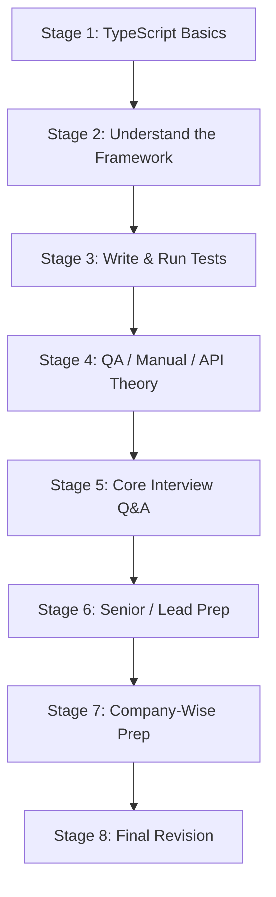

# 📚 Study Roadmap — Read in This Order
### Your step-by-step path from basics → framework → interview-ready

*The single starting point. Follow the sequence top to bottom.*

---

> **Start here.** This file tells you **what to study first, second, third…** so you never feel
> lost. Each stage links to the exact guide and section. Don't skip ahead — each stage builds on
> the previous one.

---

## 🗺️ The Big Picture

---

## ✅ The Sequence (follow in order)

| # | Stage | What to study | Where | Time |
|---|-------|---------------|-------|------|
| 1 | **Learn the language** | TypeScript basics — types, interfaces, classes, async/await | [LEARNING_GUIDE.md → Sec 2](LEARNING_GUIDE.md) | 2–3 days |
| 2 | **Understand the framework** | Architecture, config, POM, API client, fixtures, utils | [LEARNING_GUIDE.md → Sec 3–8](LEARNING_GUIDE.md) | 2–3 days |
| 3 | **Write & run tests** | Writing tests, playwright.config, running, cheat sheet | [LEARNING_GUIDE.md → Sec 9–12](LEARNING_GUIDE.md) | 2 days |
| 4 | **QA & testing theory** | Manual testing, JMeter, Postman, API concepts | [QA_MANUAL_PERF_API_GUIDE.md](QA_MANUAL_PERF_API_GUIDE.md) | 3 days |
| 5 | **Core interview Q&A** | TypeScript + Playwright + framework fundamentals | [INTERVIEW_GUIDE.md → Sec 13](INTERVIEW_GUIDE.md) | 2 days |
| 6 | **Senior / Lead prep** | Coding, design, management, behavioral (Indian MNC) | [SENIOR_LEAD_INTERVIEW_GUIDE.md](SENIOR_LEAD_INTERVIEW_GUIDE.md) | 3–4 days |
| 7 | **Company-wise prep** | Tailor to your target company's pattern | [COMPANY_WISE_INTERVIEW_GUIDE.md](COMPANY_WISE_INTERVIEW_GUIDE.md) | 1–2 days |
| 8 | **Final revision** | Checklists, cheat sheets, rapid-fire | [INTERVIEW_GUIDE.md → Sec 16](INTERVIEW_GUIDE.md) + cheat sheets | 1 day |

> **Total:** ~2.5–3 weeks at a steady pace. Compress to ~1 week if you already know the basics
> (jump straight to Stage 4).

---

## 📖 Stage-by-Stage Detail

### Stage 1 — Learn TypeScript (the language) 🟢 *Beginner*

**Goal:** be comfortable reading and writing TypeScript.

- [ ] Variables, types, `interface` vs `type`
- [ ] Functions, optional/default params, arrow functions
- [ ] Classes, inheritance, access modifiers
- [ ] Generics, union/intersection types
- [ ] `async`/`await`, Promises
- [ ] Modules (`import`/`export`)

📍 **Study:** [LEARNING_GUIDE.md → Section 2 (TypeScript Crash Course)](LEARNING_GUIDE.md)

✅ **You're ready for Stage 2 when:** you can read any `.ts` file in this repo and understand it.

---

### Stage 2 — Understand the Framework 🟢 *Beginner → 🟡 Intermediate*

**Goal:** know how every part of the framework fits together.

- [ ] Project architecture & folder structure
- [ ] Config & environments — [config/environments.ts](config/environments.ts)
- [ ] Page Object Model — [BasePage.ts](src/ui/pages/BasePage.ts), [LoginPage.ts](src/ui/pages/LoginPage.ts)
- [ ] API client pattern — [BaseApiClient.ts](src/api/clients/BaseApiClient.ts), [UserApi.ts](src/api/endpoints/UserApi.ts)
- [ ] Fixtures / dependency injection — [src/fixtures/index.ts](src/fixtures/index.ts)
- [ ] Utilities — [logger.ts](src/utils/logger.ts), [helpers.ts](src/utils/helpers.ts)

📍 **Study:** [LEARNING_GUIDE.md → Sections 3–8](LEARNING_GUIDE.md)

✅ **Ready for Stage 3 when:** you can explain what each folder/file does in your own words.

---

### Stage 3 — Write & Run Tests 🟡 *Intermediate*

**Goal:** write your own test and run the suite.

- [ ] Writing UI tests — [tests/ui/login.ui.spec.ts](tests/ui/login.ui.spec.ts)
- [ ] Writing API tests — [tests/api/users.api.spec.ts](tests/api/users.api.spec.ts)
- [ ] Combined UI + API — [tests/ui/combined.spec.ts](tests/ui/combined.spec.ts)
- [ ] `playwright.config.ts` (projects, reporters, retries)
- [ ] Run commands & reading reports

📍 **Study:** [LEARNING_GUIDE.md → Sections 9–12](LEARNING_GUIDE.md)

✅ **Ready for Stage 4 when:** you've written and run one test of your own.

---

### Stage 4 — QA & Testing Theory 🟡 *Intermediate*

**Goal:** the testing knowledge every QA must know (and interviewers always ask).

- [ ] Manual testing fundamentals & process (SDLC/STLC, defect lifecycle)
- [ ] Test design techniques (BVA, equivalence, decision table)
- [ ] JMeter — load & performance testing
- [ ] Postman — API testing
- [ ] API concepts (HTTP/REST, auth, status codes)

📍 **Study:** [QA_MANUAL_PERF_API_GUIDE.md (all sections)](QA_MANUAL_PERF_API_GUIDE.md)

✅ **Ready for Stage 5 when:** you can explain severity vs priority, smoke vs sanity, and the
defect lifecycle without notes.

---

### Stage 5 — Core Interview Q&A 🟡 *Intermediate*

**Goal:** answer the fundamentals confidently.

- [ ] TypeScript Q&A
- [ ] Playwright Q&A
- [ ] Framework & design Q&A
- [ ] Rapid-fire round

📍 **Study:** [INTERVIEW_GUIDE.md → Section 13](INTERVIEW_GUIDE.md)

✅ **Ready for Stage 6 when:** you can answer any core question out loud in under a minute.

---

### Stage 6 — Senior / Lead Prep 🔴 *Advanced*

**Goal:** ready for 5–12 yr Senior/Lead/SDET interviews.

- [ ] Coding & DSA snippets (write from memory)
- [ ] Framework design & scalability
- [ ] Test management & strategy (test plan, metrics, estimation)
- [ ] Managerial round (conflict, deadlines, critical bug)
- [ ] Behavioral / HR (STAR stories with numbers)

📍 **Study:** [SENIOR_LEAD_INTERVIEW_GUIDE.md (all sections)](SENIOR_LEAD_INTERVIEW_GUIDE.md)

✅ **Ready for Stage 7 when:** you have 6–8 STAR stories prepared and can whiteboard your framework
in 3 minutes.

---

### Stage 7 — Company-Wise Prep 🔴 *Advanced*

**Goal:** tailor your preparation to your target company.

- [ ] Read your target company's section (process + emphasis)
- [ ] Check the comparison matrix to know the coding/behavioral bar
- [ ] Master the universal question bank (asked everywhere)

📍 **Study:** [COMPANY_WISE_INTERVIEW_GUIDE.md](COMPANY_WISE_INTERVIEW_GUIDE.md)

✅ **Ready for Stage 8 when:** you know exactly what your target company emphasizes.

---

### Stage 8 — Final Revision 🟢 *Last 1–2 days*

**Goal:** lock it in before the interview.

- [ ] Final revision checklist — [INTERVIEW_GUIDE.md → Section 16](INTERVIEW_GUIDE.md)
- [ ] Senior cheat sheet — [SENIOR_LEAD_INTERVIEW_GUIDE.md → Section 9](SENIOR_LEAD_INTERVIEW_GUIDE.md)
- [ ] Company-wise quick matrix & universal bank — [COMPANY_WISE_INTERVIEW_GUIDE.md](COMPANY_WISE_INTERVIEW_GUIDE.md)
- [ ] QA quick tables — [QA_MANUAL_PERF_API_GUIDE.md → Section F](QA_MANUAL_PERF_API_GUIDE.md)

✅ **You're interview-ready.** 🎉

---

## 🎯 Shortcut Paths (if you're short on time)

| Your situation | Skip to | Then |
|----------------|---------|------|
| **New to automation** | Stage 1 | Follow all stages in order |
| **Know TS, new to this framework** | Stage 2 | → 3 → 4 → 5 → 6 → 7 → 8 |
| **Experienced, interview in a week** | Stage 4 | → 5 → 6 → 7 → 8 |
| **Senior/Lead, interview in 3 days** | Stage 6 | → 7 → 8 |
| **Interview tomorrow** | Stage 8 | All cheat sheets + your company section |

---

## 📂 All Guides at a Glance

| Guide | Purpose |
|-------|---------|
| [LEARNING_GUIDE.md](LEARNING_GUIDE.md) | Learn TypeScript + the framework from scratch |
| [QA_MANUAL_PERF_API_GUIDE.md](QA_MANUAL_PERF_API_GUIDE.md) | Manual testing, JMeter, Postman, API theory |
| [API_PERFORMANCE_TESTING_GUIDE.md](API_PERFORMANCE_TESTING_GUIDE.md) | Deep-dive: API + JMeter + load/performance (top MNC Q&A) |
| [INTERVIEW_GUIDE.md](INTERVIEW_GUIDE.md) | Core + senior Playwright/TS interview Q&A |
| [SENIOR_LEAD_INTERVIEW_GUIDE.md](SENIOR_LEAD_INTERVIEW_GUIDE.md) | Senior/Lead Q&A (coding, design, managerial) |
| [COMPANY_WISE_INTERVIEW_GUIDE.md](COMPANY_WISE_INTERVIEW_GUIDE.md) | Company-by-company patterns & questions |
| **STUDY_ROADMAP.md** | 👈 You are here — the order to study everything |

---

*Tip: tick the checkboxes as you go. Steady daily progress beats last-minute cramming.*

[⬆ Back to top](#-study-roadmap--read-in-this-order)

